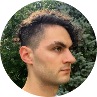

<link rel="stylesheet" type="text/css" href="/styles/onecolumn.css" />

<article class="textBlock">
<h1 class="sectionHeader">Bio</h1>
<!-- head shot - maybe glitch up? -->
<!--  -->

Reilly Spitzfaden (they/them) is a composer who likes noise, code, electronics, and nostalgia. They build handmade electronic instruments, design interactive software interfaces, and repurpose audio and telecommunications equipment as instruments.

Reilly's recordings appear on Apply Triangle’s release [_Oxalis Triangularis: Vol. 2_](https://applytriangle.bandcamp.com/album/oxalis-triangularis-vol-2); [_How Things Are Made, S3E02_](https://howthingsaremade.bandcamp.com/album/htam-s3e02); in the Media Sandbox and Michigan State University Department of Theatre film [_(313) Choices_](https://vimeo.com/173638277); and on the recording [_Statements_](https://msucomp.bandcamp.com/album/statements) with the Michigan State University composition studio. Reilly’s compositions have been performed at the Darmstädter Ferienkurse and the TaPIR Lab, and by BlackBox Ensemble, the Eastman BroadBand, members of ensemble mise-en, the Amaranth Quartet, OSSIA New Music, and How things are made.

Reilly is currently a lecturer in music technology, film and game scoring, and music business at SUNY Geneseo. They hold a PhD in composition from the Eastman School of Music where they studied with Ricardo Zohn-Muldoon, David Liptak, and Oliver Schneller; an MA in composition from Eastman, where they studied with Robert Morris and Carlos Sanchez-Gutierrez; and a BM in composition from Michigan State University.

</article>

<h1><a href="../documents/spitzfaden-CV-2024.pdf">CV</a></h1>
